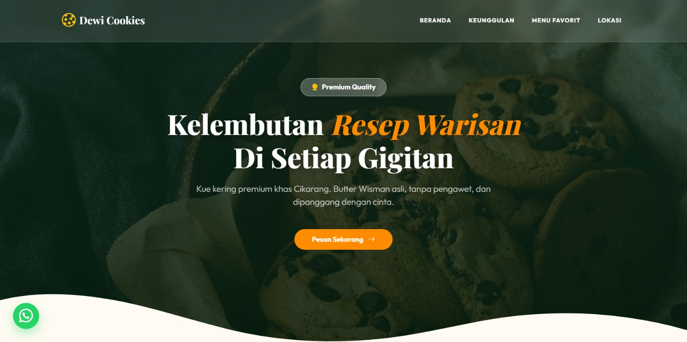
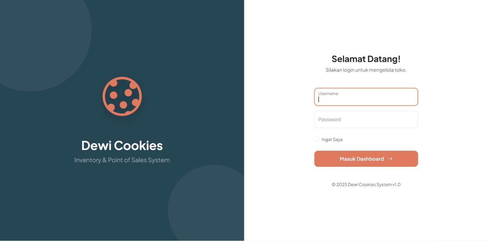
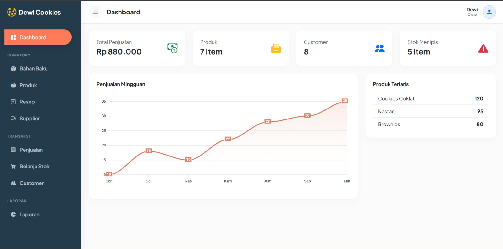

# SI-Inventory

SI-Inventory adalah **sistem informasi inventaris berbasis web** yang dikembangkan untuk membantu klien dalam mengelola data barang dan stok secara terstruktur, dengan penerapan **Role-Based Access Control (RBAC)** antara **Owner** dan **Karyawan**.

Sistem ini dikembangkan sebagai **client-based project** dan dirancang agar dapat dikembangkan lebih lanjut hingga tahap deployment produksi sesuai kebutuhan operasional klien

---

## Latar Belakang
Pada banyak organisasi atau usaha skala kecil hingga menengah, proses pengelolaan inventaris masih dilakukan secara manual atau menggunakan pencatatan sederhana. Hal ini sering menyebabkan:
- Ketidaksesuaian antara stok fisik dan data sistem
- Sulitnya menelusuri histori transaksi barang
- Tidak adanya pembatasan hak akses antar pengguna
- Risiko kesalahan input data oleh pihak yang tidak berwenang

SI-Inventory hadir sebagai solusi untuk mendigitalisasi proses inventaris sekaligus menerapkan kontrol akses berbasis peran pengguna.

---

## Tujuan Pengembangan
Tujuan dari pengembangan sistem ini adalah:
- Menyediakan sistem inventaris berbasis web yang terstruktur
- Menerapkan kontrol akses pengguna berbasis peran (RBAC)
- Memisahkan kewenangan antara owner dan karyawan
- Mendukung pencatatan transaksi barang masuk dan keluar
- Menjadi fondasi sistem yang dapat dikembangkan dan diintegrasikan dengan modul lain (ERP)

---

## Konteks Pengembangan (Client-Based)
SI-Inventory dikembangkan berdasarkan kebutuhan awal klien sebagai sistem pencatatan inventaris. Saat ini sistem masih berada pada tahap **pengembangan dan validasi fitur**, dan direncanakan untuk dilakukan pengembangan lanjutan serta proses deployment setelah dilakukan konsultasi berikutnya dengan klien.

Pengembangan sistem dilakukan secara bertahap agar dapat menyesuaikan kebutuhan operasional dan kesiapan pengguna.

---

## Role & Hak Akses Pengguna
Sistem ini menerapkan **Role-Based Access Control (RBAC)** dengan pembagian peran sebagai berikut:

### 🔹 Owner
Owner memiliki hak akses penuh terhadap sistem, antara lain:
- Mengelola data barang
- Melihat dan mengelola seluruh transaksi
- Monitoring stok secara keseluruhan
- Mengelola akun pengguna
- Akses terhadap data laporan

### 🔹 Karyawan
Karyawan memiliki hak akses terbatas, antara lain:
- Melihat data barang
- Melakukan pencatatan transaksi barang masuk dan keluar
- Tidak memiliki akses terhadap pengaturan sistem dan manajemen pengguna

Pembagian hak akses ini bertujuan untuk menjaga keamanan data dan meminimalkan kesalahan operasional.

---

## Fitur Utama
Fitur-fitur utama yang tersedia dalam sistem ini meliputi:
- Manajemen data barang
- Pencatatan stok barang
- Pencatatan transaksi barang masuk dan keluar
- Autentikasi pengguna
- Kontrol akses berbasis peran (RBAC)
- Penyajian data inventaris secara terstruktur

---

## Screenshot Sistem

Berikut adalah beberapa tampilan utama dari sistem SI-Inventory:

### Index

### Login

### Dashboard 

---

## Teknologi yang Digunakan
Sistem ini dikembangkan menggunakan teknologi berikut:
- **Laravel** – Framework backend PHP
- **PHP** – Bahasa pemrograman server-side
- **MySQL** – Database relasional
- **Blade Template** – Antarmuka pengguna
- **Bootstrap / Tailwind CSS** – Styling antarmuka
- **Git & GitHub** – Version control dan kolaborasi

---

## Gambaran Alur Sistem
Pengguna melakukan login ke sistem sesuai perannya. Owner dan karyawan akan mendapatkan hak akses dan fitur yang berbeda. Setiap transaksi barang masuk dan keluar akan memengaruhi jumlah stok di dalam sistem secara terpusat dan tercatat.

---

## Potensi Pengembangan Lanjutan
Sistem ini masih dapat dikembangkan lebih lanjut, antara lain:
- Penambahan modul laporan dan analisis inventaris
- Notifikasi stok minimum
- Pengembangan dashboard monitoring
- Integrasi dengan sistem ERP atau modul produksi
- Pengembangan API untuk integrasi eksternal

---

## Status Project
🟡 **In Development – Client-Based Project**

Sistem ini dikembangkan untuk klien dan masih dalam tahap pengembangan serta evaluasi. Pengembangan lanjutan dan proses deployment akan dilakukan setelah konsultasi berikutnya dengan klien.

